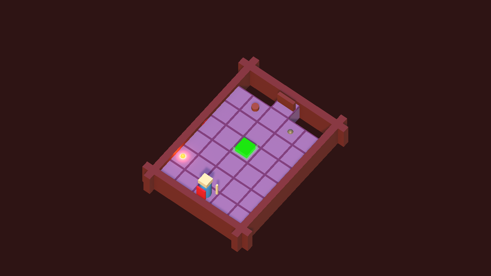
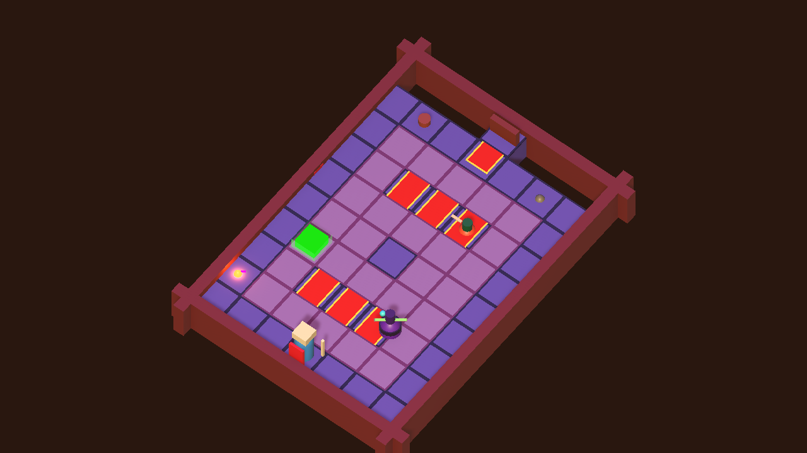
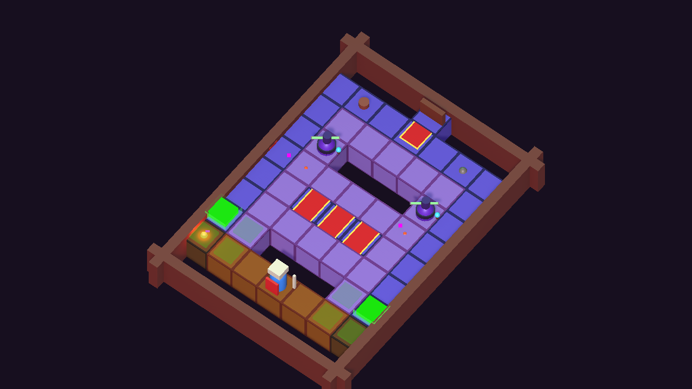
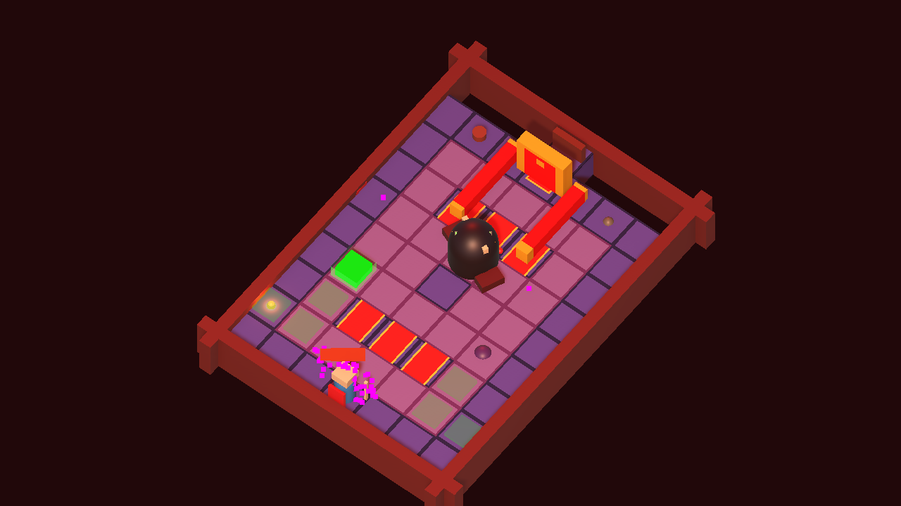

# Memoria - VJ 3D Looty Dungeon

> Borrador listo para adaptar al formato final de la asignatura. Revisar nombres completos, reparto real y capturas manuales de UI antes de exportar a PDF.

## 1. Datos del proyecto

- Asignatura: VJ, FIB UPC.
- Proyecto: videojuego 3D tipo dungeon crawler inspirado en Looty Dungeon.
- Integrantes: Carolina Rouj y Mateus.
- Motor: Unity 6000.4.4f1.
- Escena principal: `Assets/Scenes/LevelScene.unity`.
- Rama de trabajo: `mateus`.

## 2. Descripcion del juego

El juego es un dungeon crawler 3D con camara ortografica isometrica. El jugador avanza por 10 salas, recoge monedas, derrota enemigos y cruza una puerta que solo se abre cuando la sala queda limpia. A partir de la tercera sala el suelo cae por filas, aumentando la presion de tiempo. La ultima sala contiene un boss con varias vidas y patrones de ataque propios.

El objetivo de diseno ha sido cubrir todos los requisitos basicos y reforzar el game feel con feedback inmediato: sonido, particulas, shake de camara, barras de vida, animaciones de puerta, efectos de trampas, antorchas iluminadas y ataques diferenciados por enemigo.

## 3. Controles

- `Enter`: empezar partida.
- `WASD` o flechas: mover jugador.
- `Shift`: dash corto para esquivar.
- `Espacio` o click: atacar.
- `P` o `Esc` durante el juego: pausar/reanudar. Desde la pausa, `Enter`/`P` reanuda y `M` vuelve al menu.
- `Esc` en menus/derrota/victoria: volver al menu.
- `R` o `Enter` al perder: reintenta la sala.
- `M` o `Enter` al ganar: vuelve al menu.
- `0`-`9`: saltar a salas para debug/evaluacion.

## 4. Requisitos basicos implementados

| Requisito | Implementacion |
| --- | --- |
| 10 salas | JSONs `level1` a `level9` y `final_level`, cargados por `LevelManager`. |
| Dificultad creciente | Mas enemigos, trampas, variedad de enemigos y suelo que cae en salas avanzadas. |
| Puerta cerrada | `DungeonDoor` permanece solida hasta que `DungeonGameRuntime` detecta cero enemigos vivos. |
| 3 enemigos | `Slime`, `Bat`, `Wizard`, `Gnome`; ademas boss final. |
| Rastro ralentizante | `Slime` instancia `RastroSlime`, que aplica slow y feedback visual. |
| Boss final | `Boss` con 8 vidas, barra de vida y proyectiles en abanico. |
| Ataque jugador | `PlayerCombat.Attack()` usa overlap frontal, slash visual y SFX. |
| Enemigos atacan | Contacto por `EnemyTouchDamage`; wizard/boss tienen proyectiles. |
| 3 vidas jugador | `Health = 3`, invulnerabilidad temporal y estado `GameOver`. |
| Suelo cae | `LevelManager.StartFallingRowsIfNeeded` desde sala 3 hasta sala 9, excluyendo boss. |
| Camara ortografica | `CameraFollowDungeon`, camara fija por sala con rotacion isometrica. |
| 3 trampas | `Spikes`, `Flame`, `Blade`, `SpiderWebs` y `RetractileFork`, todas integradas con dano/ralentizacion y feedback. |
| Monedas | `CoinPickup`, contador HUD, SFX y particulas. |
| Corazones | `HealthPickup` con ~18% de probabilidad de drop por enemigo derrotado, solo si el jugador tiene menos de 3 HP; recupera 1 punto y reproduce VFX/SFX dedicados. |
| Decoraciones | Antorcha, caja, pilar, estatua, banner y paredes por sala. |
| GUI | Vida, monedas, salas superadas, sala actual, barra de progreso, boton de menu y resumen final. |
| Pantallas | Menu, juego, pausa, creditos, derrota y victoria. |
| Audio | Musica procedural de menu/juego y SFX runtime. |
| Salto debug | Teclas `0`-`9` para saltar de sala; el HUD mantiene salas superadas coherentes. |

## 5. Game feel y arte

- Ataque con slash, sonido, particulas y camara shake.
- Dash con estela visual, SFX, shake y cooldown.
- Golpes a enemigos con flash, barra de vida, texto flotante de dano/KO y particulas.
- Muerte de enemigos con retraso, sonido y burst de particulas.
- Jugador con knockback, parpadeo, texto flotante, overlay rojo e invulnerabilidad tras recibir dano.
- Puerta con cambio de material, compresion visual, texto `OPEN`, sonido y particulas.
- Monedas con rotacion/flotacion, texto flotante y feedback al recoger.
- Trampas con animacion, activacion visual y audio.
- Suelo que cae con aviso previo, caida animada, sonido, shake y particulas.
- Slime con rastro ralentizante visible.
- Wizard y boss con proyectiles emisivos.
- Iluminacion runtime: luz principal, rim light, fog y antorchas con luz puntual y particulas.
- UI escalable con HUD compacto, indicador de 10 salas (verde/amarillo/rojo para boss), contador de enemigos vivos en sala y cronometro.
- Transicion suave (fundido a negro) entre salas para ocultar la carga.
- Ambiente diferenciado por seccion de mazmorra: salas 1-3 calidas, 4-6 marrones, 7-9 violetas frias y boss en rojo dramatico con suelo, niebla, ambient y luces ajustadas; en la entrada del boss se dispara shake, particulas y texto "BOSS".
- Banner de seccion en HUD al cruzar entre bloques (Atrios, Galerias, Catacumbas, Salon del boss) con fundido in/out.
- Musica procedural propia para el boss (`BossLoop` con drone + quinta + modulacion 3.4 Hz) que reemplaza la musica estandar al cargar `final_level`.
- Pausa con `P`/`Esc` que congela el tiempo con `Time.timeScale=0` y panel propio con `Continuar` y `Menu`.
- Resumen de partida en pantallas de victoria y derrota: monedas, KO, tiempo total y mejor partida persistente en `PlayerPrefs`.
- Menu de inicio muestra mejor partida persistente si hay datos.

## 6. Arquitectura tecnica

- `DungeonGameRuntime`: estado global del juego (Menu, Credits, Playing, Paused, GameOver, Victory), HUD, jugador, vida, monedas, puertas, audio, VFX, transiciones, stats de partida y persistencia de mejor partida via `PlayerPrefs`.
- `DungeonGameRuntime.ApplySectionAmbience`: tinta camara, fog, ambient y luces direccionales por seccion (1-3 / 4-6 / 7-9 / boss) para reforzar progresion visual.
- `LevelManager`: carga JSONs, instancia suelo, paredes, decoraciones, monedas, enemigos, trampas y filas que caen.
- `Assets/Resources/Levels/*.json`: definicion de salas.
- `Slime`, `Bat`, `Wizard`, `Gnome`, `Boss`: comportamiento de enemigos.
- `RastroSlime`: slow del jugador.
- `RuntimeTrap`: trampas generadas por codigo.
- `EnemyProjectile`: proyectiles enemigos runtime.
- `Dungeon*Smoke` (incluye `DungeonPauseSmoke`) y `DungeonDeliveryValidator`: validadores automatizados en batchmode para gameplay, pausa, build y entregables.

## 7. Reparto de trabajo

> Ajustar con el reparto real del PDF antes de entregar.

- Carolina:
  - Base inicial de escena/niveles/prefabs indicados en el enunciado.
  - Assets/prefabs disponibles en el repositorio.
  - Parte marcada en verde en el PDF.
- Mateus:
  - Runtime jugable completo, HUD, puertas, player combat, vida, game over/victory.
  - Integracion de niveles, monedas, trampas runtime, suelo que cae, validadores y build smoke.
  - Game feel adicional: VFX/SFX, camara, luz, proyectiles, barras de vida y memoria.
- Conjunto:
  - Diseno de salas, balance, playtest, revision final y memoria.

## 8. Capturas

Capturas automaticas disponibles:

Sala inicial:



Sala avanzada con trampas:



Suelo cayendo:



Boss final:



Capturas manuales recomendadas para completar la memoria final:

- Menu principal.
- Creditos.
- HUD durante combate.
- Pantalla de victoria.
- Pantalla de derrota.

## 9. Validacion

Ultima bateria automatizada relevante:

```bash
Tools/run_validation.sh
```

Este script ejecuta whitespace check, validadores de requisitos/entrega, smokes de Play Mode, capturas y build.

```bash
git diff --check
```

```bash
/home/maziu/Unity/Hub/Editor/6000.4.4f1/Editor/Unity -quit -batchmode -projectPath /home/maziu/uni/VJ-3D/repo -executeMethod DungeonBatchValidator.Run -logFile /tmp/vj-pre-merge-validator.log
```

```bash
/home/maziu/Unity/Hub/Editor/6000.4.4f1/Editor/Unity -batchmode -projectPath /home/maziu/uni/VJ-3D/repo -executeMethod DungeonPlaySmoke.Run -logFile /tmp/vj-pre-merge-play.log
```

```bash
/home/maziu/Unity/Hub/Editor/6000.4.4f1/Editor/Unity -batchmode -projectPath /home/maziu/uni/VJ-3D/repo -executeMethod DungeonAllLevelsSmoke.Run -logFile /tmp/vj-pre-merge-all-levels.log
```

```bash
/home/maziu/Unity/Hub/Editor/6000.4.4f1/Editor/Unity -batchmode -projectPath /home/maziu/uni/VJ-3D/repo -executeMethod DungeonRequirementsSmoke.Run -logFile /tmp/vj-pre-merge-requirements.log
```

```bash
/home/maziu/Unity/Hub/Editor/6000.4.4f1/Editor/Unity -batchmode -projectPath /home/maziu/uni/VJ-3D/repo -executeMethod DungeonMenuSmoke.Run -logFile /tmp/vj-pre-merge-menu.log
```

```bash
/home/maziu/Unity/Hub/Editor/6000.4.4f1/Editor/Unity -quit -batchmode -projectPath /home/maziu/uni/VJ-3D/repo -executeMethod DungeonDeliveryValidator.Run -logFile /tmp/vj-pre-merge-delivery.log
```

```bash
/home/maziu/Unity/Hub/Editor/6000.4.4f1/Editor/Unity -batchmode -projectPath /home/maziu/uni/VJ-3D/repo -executeMethod DungeonScreenshotCapture.Run -logFile /tmp/vj-pre-merge-screenshot.log
```

```bash
/home/maziu/Unity/Hub/Editor/6000.4.4f1/Editor/Unity -quit -batchmode -projectPath /home/maziu/uni/VJ-3D/repo -executeMethod DungeonBuildSmoke.Run -logFile /tmp/vj-pre-merge-build.log
```

Resultados:

- `[DungeonBatchValidator] OK`
- `[DungeonPlaySmoke] OK`
- `[DungeonAllLevelsSmoke] OK`
- `[DungeonRequirementsSmoke] OK`
- `[DungeonMenuSmoke] OK`
- `[DungeonDeliveryValidator] OK`
- `[DungeonScreenshotCapture] OK`
- `[DungeonBuildSmoke] OK size=99780244 bytes`

Tambien se ha anadido un modo oculto `-vjSmokeTest` para probar el ejecutable Linux desde una sesion con display disponible:

```bash
Builds/Linux/VJ3D.x86_64 -batchmode -vjSmokeTest -logFile /tmp/vj-player-smoke.log
```

## 10. Problemas encontrados y soluciones

- Repositorio inicial equivocado: se clono el repositorio correcto y se trabajo desde `develop` en la rama `mateus`.
- Activacion de Unity batchmode: se valido que Unity 6000.4.4f1 ejecuta compilacion y Play Mode desde terminal.
- Prefabs no asignados para algunos enemigos/trampas: se implementaron fallbacks runtime para no bloquear el juego.
- Capturas de UI en batchmode: Unity no expone el Game View de IMGUI de forma fiable; se automatizaron capturas 3D y se dejan capturas de UI como tarea manual.
- Suelo que cae y respawn: el spawn busca una baldosa activa para evitar reaparecer sobre un hueco.
- Trampas nuevas sin prefab completo: se adaptaron `SpiderWebs` y `RetractileFork` al runtime, se anadieron fallbacks visuales y se cubrieron con smoke test de efectos.

## 11. Trabajo pendiente antes de entregar

- Playtest humano completo en editor o build.
- Ajustar balance si salas 7-9 o boss se sienten injustos.
- Hacer capturas manuales de UI si se quieren incluir.
- Revisar reparto real segun colores del PDF.
- Exportar esta memoria a PDF con capturas insertadas.

Apoyo para cerrar la memoria:

- `Docs/RUBRIC_SCORECARD.md` resume la correspondencia entre rubrica, implementacion y evidencias.
